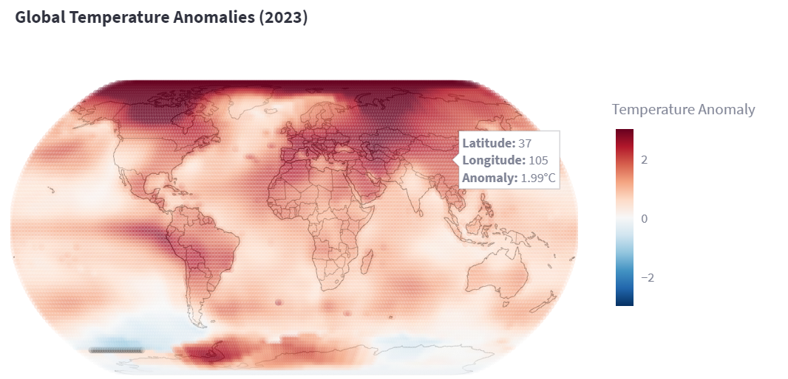

# Vizualizing Climate Change (Streamlit-and-Docker-basics)

## Description
This project demonstrates the basics of using Streamlit with Docker. To do so, we are using two visualizations based on the [GISTEMP](https://data.giss.nasa.gov/gistemp/) data on historical temperatuer anomalies.




## Installation

### Prerequisites
- Python 3.7 or higher
- Docker

### Steps
1. Clone the repository:
    ```sh
    git clone https://github.com/matthieudelsart/climate-change-app.git
    ```

## Usage

### Running Streamlit App Locally
1. Navigate to the project directory:
    ```sh
    cd climate-change-app
    ```

2. Run the Streamlit root page:
    ```sh
    streamlit run Welcome.py
    ```

### Running Streamlit App with Docker
1. Build the Docker image:
    ```sh
    docker build -t streamlit-app .
    ```

2. Run the Docker container:
    ```sh
    docker run -p 8501:8501 streamlit-app
    ```

3. Open your browser and go to `http://localhost:8501` to see the app.

4. If need be, the docker image can be found there `https://hub.docker.com/repository/docker/mdelsart/climate-change-app`
